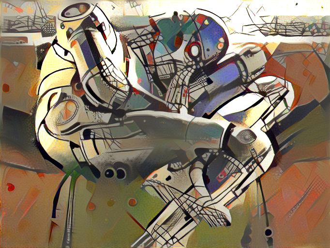

# PyDeepStyle

PyDeepStyle is originated from Keras <https://keras.io> example implementation of neural style transfer to create "deep" and impressive image (The original paper "A Neural Algorithm of Artistic Style" can be found at <https://arxiv.org/abs/1508.06576>)

We shall try to run an algorithm for combining the content of one image with the style of another image using pre-trained convolutional neural networks. Here's an example that maps the artistic style of Kandinsky's " TranverseLine" onto Ralph McQuarrie's "Robot Dreams" to create an unique artistic image. Obviously, that hair style is destined to harmonize with Vangogh's curvy strokes.



The full installation instruction (on Windows 10) can follow the Blog post at:

<http://bennycheung.github.io/deep-learning-on-windows-10>

## deepstyle.py

> The script has been updated to work with latest Keras 2.1.6 [2018/05/08]

The python script is `deepstyle.py` is the Keras implementation of the neural style transfer algorithm, using a pre-trained convolutional neural network (VGG19).

The `run.sh` bash script takes your input {content_image}, {style_image} and {output_directory} for generating the results.

```bash
sh run.sh robotdreams.jpg Style_TransverseLine.jpg robotdreams_TransverseLine
```

For each epoch, an iteration image will be saved in the `result_image` directory with an image `result_image_at_iteration_{N}.png` file (where {N} is the iteration number). This is interesting to trace through how the neural network perceived and built the image.

On a GTX 1070 GPU (has 1,920 cores), the time required for each epoch depends on the image size (gram matrix size):

* For 400x400 gram matrix, each epoch takes approximately 13 seconds.
* For 512x512 gram matrix, each epoch takes approximately 20 seconds.

Most of the style seems to be converged after 25 epoch. You can try a higher number of iterations for higher quality style transfer's convergence.

For reader's convenience, the script input parameters are repeated here:

* *--image_size* : Allows to set the Gram Matrix size. Default is 400 (width), since it produces good results fast.
* *--iter* : Number of iterations. Default is 10. Test the output with 10 iterations, and increase to improve results.
* *--tv_weight* : Regularization factor. Smaller values tend to produce crisp images, but 0 is not useful. Default = 1E-5
* *--content_layer* : Selects the content layer. Paper suggests block4_conv2, but better results can be obtained from block5_conv2. Default is block5_conv2.
* *--min_improvement* : Defines minimum improvement required to continue script. Default is 0.0
